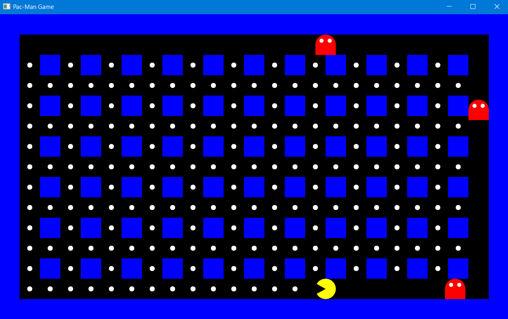

# PACKMAN COM JAVAFX
👨‍🏫O JOGO É IDEAL PARA FÃS DE JOGOS RETRÔ E OFERECE UMA EXPERIÊNCIA DIVERTIDA COM GRÁFICOS SIMPLES E MECÂNICAS CLÁSSICAS.

 <br>

## DESCRIÇÃO: 
Essa é uma recriação do clássico jogo de arcade, onde o jogador controla o personagem principal, **Pac-Man**, em um labirinto cheio de paredes, inimigos (fantasmas) e pellets (pontos a serem coletados). O objetivo do jogo é guiar o Pac-Man através do labirinto, comendo todos os pellets enquanto evita os inimigos, que perseguem o personagem.  

## EXECUTANDO O PROJETO:
1. **Certifique-se de que o projeto esteja compilado:**
   Antes de executar o projeto, você deve garantir que ele foi compilado corretamente. Navegue até o diretório `./CODIGO`, e use o seguinte comando para compilar:

   ```bash
   mvn clean install
   ```

2. **Executar o projeto:**
   Para executar a aplicação com o Maven, usando a classe principal definida no seu `pom.xml`, use o comando:

   ```bash
   mvn javafx:run
   ```

## COMO JOGAR?  
1. **Movimentação**:  
   - Use as teclas direcionais (**Setas do teclado**: `↑`, `↓`, `←`, `→`) para mover o Pac-Man pelo labirinto.  
   - Cada tecla move o personagem em uma direção específica (cima, baixo, esquerda, direita).  

2. **Objetivo**:  
   - Coma todos os pellets brancos espalhados pelo labirinto para completar o jogo.  
   - Evite o contato com os inimigos (fantasmas). Se Pac-Man colidir com um fantasma, o jogo termina.  

3. **Inimigos**:  
   - Os inimigos se movem pelo labirinto tentando alcançar Pac-Man. Eles mudam de direção e velocidade, tornando o desafio mais dinâmico.  

4. **Dica**:  
   - Planeje sua rota no labirinto com antecedência para evitar ser cercado pelos inimigos.  

## TECNOLOGIAS USADAS:
- [LINGUAGEM JAVA:](https://github.com/VILHALVA/CURSO-DE-JAVA) A linguagem de programação Java é amplamente utilizada para o desenvolvimento de aplicativos devido à sua portabilidade, segurança e robustez. Ela é uma escolha popular para desenvolver aplicativos desktop, web e móveis.

- [JAVAFX:](https://github.com/VILHALVA/CURSO-DE-JAVAFX) JavaFX é uma Bíblioteca (plataforma) de desenvolvimento rica para criar aplicações gráficas (GUI) modernas e sofisticadas em Java. Ele é projetado para substituir o Swing como a principal biblioteca para GUIs no Java. JavaFX oferece uma ampla gama de recursos que tornam o desenvolvimento mais intuitivo, flexível e visualmente atraente.

## CREDITOS:
- [PROJETO CRIADO PELO "peterarsentev"](https://github.com/peterarsentev/games_oop_javafx)
- [PROJETO EDITADO PELO VILHALVA](https://github.com/VILHALVA)


